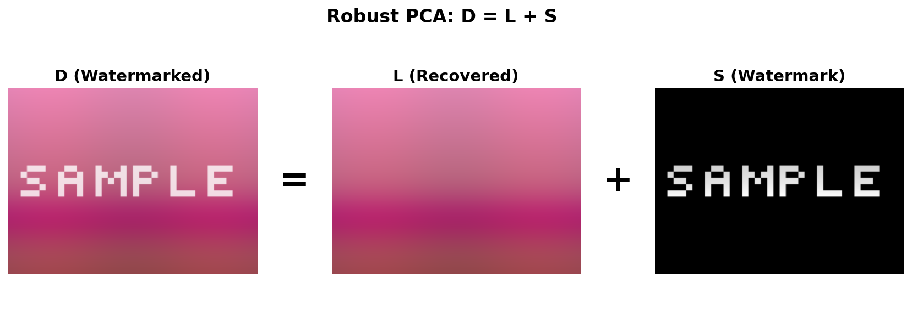
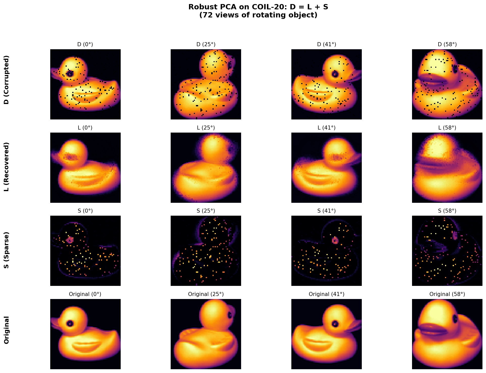

Robust PCA
==========

A Python implementation of Robust PCA using Principal Component Pursuit by alternating directions (ADMM). The theory and algorithm are described in: [Robust Principal Component Analysis?](https://dl.acm.org/doi/10.1145/1970392.1970395) (Candès et al., 2011)

## What is Robust PCA?

Robust PCA decomposes a data matrix **D** into two components:

```
D = L + S
```

where:
- **L** is a **low-rank** matrix (captures the underlying structure)
- **S** is a **sparse** matrix (captures outliers/corruptions)

This is useful when your data has:
- Underlying patterns shared across observations (low-rank structure)
- Sparse corruptions, outliers, or anomalies

### Visual Example

```
┌─────────────┐     ┌─────────────┐     ┌─────────────┐
│             │     │             │     │  ·    ·     │
│  Corrupted  │  =  │  Low-rank   │  +  │    ·       ·│
│    Data     │     │  Structure  │     │  Sparse     │
│      D      │     │      L      │     │  Outliers S │
└─────────────┘     └─────────────┘     └─────────────┘
```

## Usage

```python
from r_pca import RobustPCA, np

# Create data: 3 groups with constant values
data = np.hstack([
    np.ones((100, 40)) * 10,  # Group 1: all 10s
    np.ones((100, 40)) * 20,  # Group 2: all 20s
    np.ones((100, 40)) * 30   # Group 3: all 30s
])

# Corrupt 5% of entries
mask = np.random.rand(*data.shape) < 0.05
data[mask] = 0

# Decompose into low-rank + sparse
rpca = RobustPCA(data)
L, S = rpca.fit(max_iter=500)

# L recovers the original structure
# S captures the corrupted entries
```

## Examples

### 1. Basic Recovery (examples/readme_example.py)

Full working version of the usage example above, with visualization:

```bash
python -m examples.readme_example
```


| Metric | Value |
|--------|-------|
| ‖D - (L+S)‖_F | ≈ 0.0001 |
| ‖D - (L+S)‖_F / ‖D‖_F | ≈ 10⁻⁸ |

### 2. Image Watermark Removal (examples/image_watermark_removal.py)

RPCA can separate sparse corruptions (text/watermarks) from the underlying low-rank image structure.

```bash
python -m examples.image_watermark_removal
```



| Metric | Value |
|--------|-------|
| ‖D - (L+S)‖_F | ≈ 0.00001 |
| ‖D - (L+S)‖_F / ‖D‖_F | ≈ 10⁻⁷ |

**How it works:**
- Natural images have low-rank structure (smooth gradients, repeated patterns)
- Text/watermarks are sparse (only affect a small fraction of pixels)
- L recovers the clean image, S extracts the watermark

### 3. COIL-20 Multi-View Recovery (examples/coil20_recovery.py)

Real photographs from the [Columbia Object Image Library](https://www.cs.columbia.edu/CAVE/software/softlib/coil-20.php). 72 views of a rotating object create natural low-rank structure.

```bash
python -m examples.coil20_recovery
```



| Metric | Value |
|--------|-------|
| ‖D - (L+S)‖_F / ‖D‖_F | ≈ 10⁻⁶ |
| ‖L - D_clean‖_F / ‖D_clean‖_F | ≈ 0.13 |

**How it works:**
- 72 images of the same object from different angles → low-rank matrix
- 5% of pixels corrupted (set to 0) → sparse component
- RPCA recovers the clean images by exploiting multi-view redundancy

## API Reference

### `RobustPCA(D, mu=None, lmbda=None)`

**Parameters:**
- `D`: Input data matrix (numpy array)
- `mu`: Augmented Lagrangian parameter (default: auto-computed)
- `lmbda`: Sparsity regularization (default: `1/sqrt(max(n,m))`)

### `fit(tol=None, max_iter=1000, iter_print=100)`

Run the ADMM algorithm to decompose D = L + S.

**Returns:** `(L, S)` - the low-rank and sparse components

## Implementation Notes

This implementation follows **Algorithm 1** (Principal Component Pursuit by Alternating Directions) from the [published paper](https://dl.acm.org/doi/10.1145/1970392.1970395) (Candès et al., 2011).

> **Note:** The arXiv preprint (v1, 2009) contains a different formulation of the algorithm. This code implements the version from the final ACM publication, which has corrected signs in the ADMM updates.

### Algorithm

```python
while not converged:
    L = svd_threshold(D - S + μ⁻¹Y, μ⁻¹)    # Singular value thresholding
    S = shrink(D - L + μ⁻¹Y, λμ⁻¹)          # Element-wise soft thresholding
    Y = Y + μ(D - L - S)                     # Dual variable update
```

This solves the convex optimization problem:

```
minimize  ||L||_* + λ||S||_1
subject to  D = L + S
```

where `||L||_*` is the nuclear norm (sum of singular values) and `||S||_1` is the element-wise L1 norm.

### Default Parameters

- `μ = (n × m) / (4 × ||D||_1)` — controls convergence rate
- `λ = 1 / √(max(n, m))` — balances low-rank vs sparse (from the paper's theoretical results)

## Running Tests

```bash
python -m pytest test_r_pca.py -v
```

## References

- Candès, E. J., Li, X., Ma, Y., & Wright, J. (2011). Robust Principal Component Analysis? *Journal of the ACM*, 58(3), 1-37. [ACM](https://dl.acm.org/doi/10.1145/1970392.1970395) | [arXiv](https://arxiv.org/abs/0912.3599)
