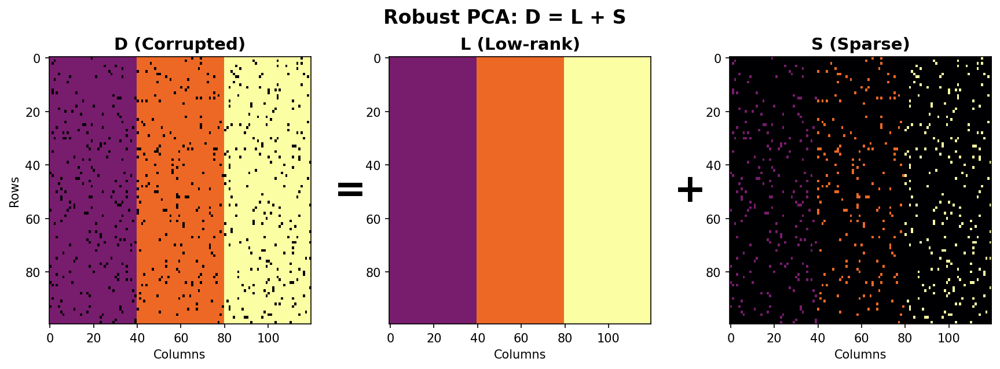
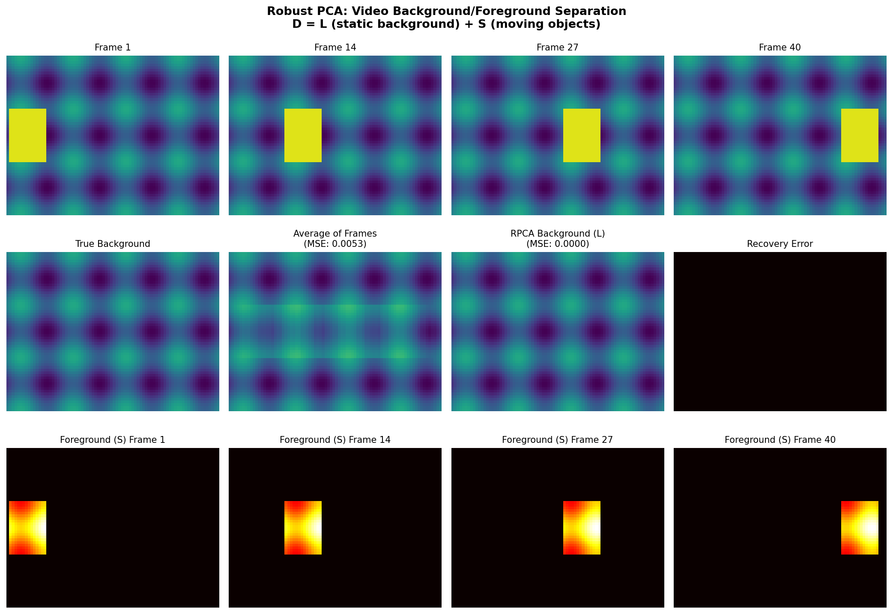

Robust PCA
==========

A Python implementation of Robust PCA using Principal Component Pursuit by alternating directions (ADMM). The theory and algorithm are described in: [Robust Principal Component Analysis?](https://arxiv.org/pdf/0912.3599.pdf) (Candes et al., 2009)

## What is Robust PCA?

Robust PCA decomposes a data matrix **D** into two components:

```
D = L + S
```

where:
- **L** is a **low-rank** matrix (captures the underlying structure)
- **S** is a **sparse** matrix (captures outliers/corruptions)

This is useful when your data has:
- Underlying patterns shared across observations (low-rank structure)
- Sparse corruptions, outliers, or anomalies

### Visual Example

```
┌─────────────┐     ┌─────────────┐     ┌─────────────┐
│             │     │             │     │  ·    ·     │
│  Corrupted  │  =  │  Low-rank   │  +  │    ·       ·│
│    Data     │     │  Structure  │     │  Sparse     │
│      D      │     │      L      │     │  Outliers S │
└─────────────┘     └─────────────┘     └─────────────┘
```

## Usage

```python
from r_pca import RobustPCA, np

# Create data: 3 groups with constant values
data = np.hstack([
    np.ones((100, 40)) * 10,  # Group 1: all 10s
    np.ones((100, 40)) * 20,  # Group 2: all 20s
    np.ones((100, 40)) * 30   # Group 3: all 30s
])

# Corrupt 20% of entries
mask = np.random.rand(*data.shape) < 0.2
data[mask] = 0

# Decompose into low-rank + sparse
rpca = RobustPCA(data)
L, S = rpca.fit(max_iter=500)

# L recovers the original structure
# S captures the corrupted entries
```

## Examples

### 1. Basic Recovery (examples/readme_example.py)

Full working version of the usage example above, with visualization:

```bash
python examples/readme_example.py
```



### 2. Video Background/Foreground Separation (examples/video_separation.py)

The classic RPCA application: given a video (matrix where each row is a frame), separate the static background from moving objects.

```bash
python examples/video_separation.py
```



**How it works:**
- Stack video frames as rows of matrix D
- Background appears in every frame → low-rank component L
- Moving objects are in different positions each frame → sparse component S

## API Reference

### `RobustPCA(D, mu=None, lmbda=None)`

**Parameters:**
- `D`: Input data matrix (numpy array)
- `mu`: Augmented Lagrangian parameter (default: auto-computed)
- `lmbda`: Sparsity regularization (default: `1/sqrt(max(n,m))`)

### `fit(tol=None, max_iter=1000, iter_print=100)`

Run the ADMM algorithm to decompose D = L + S.

**Returns:** `(L, S)` - the low-rank and sparse components

### `plot_fit(size=None, tol=0.1, axis_on=True)`

Visualize the decomposition (requires matplotlib).

## Running Tests

```bash
python -m pytest test_r_pca.py -v
```

## References

- Candès, E. J., Li, X., Ma, Y., & Wright, J. (2011). Robust Principal Component Analysis? *Journal of the ACM*, 58(3), 1-37. [arXiv:0912.3599](https://arxiv.org/abs/0912.3599)
